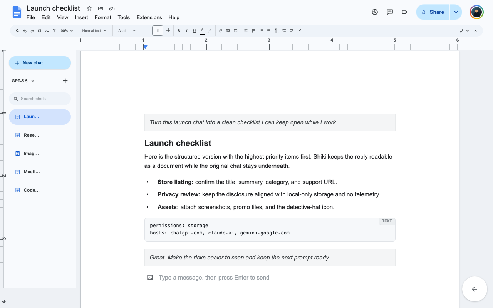
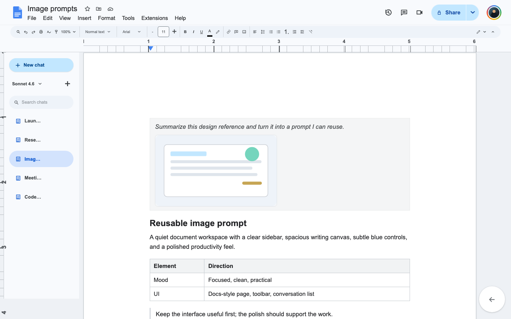

# Shiki - Docs Style for AI Chat

[](https://chromewebstore.google.com/detail/shiki-docs-style-for-ai/mkppiidnbghccgkfcahljijmimboolme)
[](https://github.com/dcablayan/Shiki/releases/download/v1.2.1/shiki-chrome-webstore-v1.2.1.zip)


Tags: `chrome-extension` `ai-chat` `docs-style-ui` `chatgpt` `claude` `gemini` `local-first`

Shiki is a Chrome extension that turns supported AI chat pages into a clean
Docs-style workspace. Conversations become document pages with a sidebar,
toolbar, rich formatting, image support, and local-only organization.

Everything runs in Chrome. Shiki has no account system, backend, analytics, ads,
or telemetry.

## Download

- [Direct download: Shiki v1.2.1 ZIP](https://github.com/dcablayan/Shiki/releases/download/v1.2.1/shiki-chrome-webstore-v1.2.1.zip)
- [Chrome Web Store download](https://chromewebstore.google.com/detail/shiki-docs-style-for-ai/mkppiidnbghccgkfcahljijmimboolme)

After installing, open ChatGPT, Claude, or Gemini. Shiki should appear
automatically. Safari support is coming soon.

**Chrome may show a trusted-developer warning because Shiki is published by a
new developer account that has not built trusted developer status yet. That
warning is expected while the publisher account is new.**

## What's New In 1.2.1

- Bounds converted image data and pending composer attachments to avoid memory
  growth in image-heavy chats.
- Makes streaming sync incremental, refreshing dirty message turns plus a small
  recent tail instead of rescanning the full transcript on every mutation burst.

## Preview





## Supported Sites

- ChatGPT: `chatgpt.com`, `chat.openai.com`
- Claude: `claude.ai`
- Gemini: `gemini.google.com`

## Features

- Docs-style chat surface with header, toolbar, ruler, page canvas, and sidebar.
- Conversation switcher with local pins, renames, and hidden chats.
- Provider-aware model and reasoning controls for ChatGPT, Claude, and Gemini.
- Rich replies for headings, lists, code blocks, tables, quotes, links, and images.
- Message sending from the document composer, including Shift+Enter new lines.
- Image attachments, custom profile picture, rich/plain text toggle, and sync refresh.

## Privacy

Shiki reads the visible AI chat page only to render the document workspace and
relay user actions back to the site's own controls. Settings, pins, renames, and
profile pictures are stored locally in Chrome extension storage.

Shiki does not send data to developer-controlled servers, sell data, run ads, or
track usage.

## Notes

- Provider page layouts change often, so selectors may need updates if a site
  redesigns conversation, composer, model, or image controls.
- Image attachment support is best-effort because each provider handles file
  inputs and drag/drop differently.
- Some generated images use short-lived `blob:` URLs that cannot always be copied
  into the document view.

## Development

Core files:

| File | Purpose |
| --- | --- |
| `manifest.json` | Chrome extension manifest (MV3) |
| `content.js` | Reads the host page and bridges actions |
| `index.html` | Docs-style overlay markup and styles |
| `skin.js` | Overlay rendering, composer, settings, and storage |
| `popup.html` / `popup.js` | Toolbar popup settings |

Package the Chrome extension with:

```sh
./scripts/package-webstore.sh
```

## Support

Report bugs by email:
[dylancablayan07@gmail.com](mailto:dylancablayan07@gmail.com?subject=Shiki%20bug%20report)

Include the AI site, what happened, and screenshots if useful.
